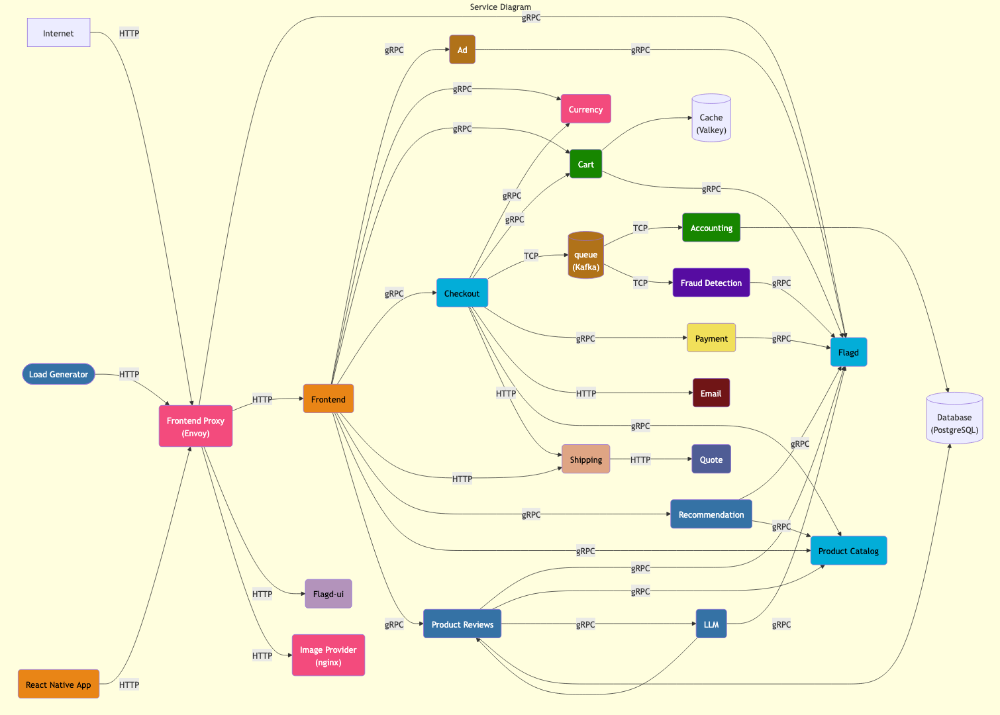
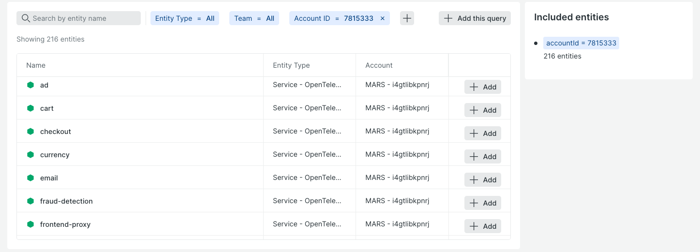

# 🪐 Welcome to the M.A.R.S. Program

Welcome to the **Maturity Architecture & Reliability Simulation (M.A.R.S.) Program** - your Game Day training for incident response using New Relic observability.

## 🎯 What is M.A.R.S.?

The M.A.R.S. Program simulates real production incidents in a safe environment.
You'll investigate issues affecting the **Astronomy Shop** - an e-commerce application - using New Relic's observability platform.

You will play against other teams, with the main **objective of identifying the root cause of multiple issues affecting your application as fast as possible**.
We will take care of fixing those issues for you, but the longer you take to identify the root cause, the longer your users will suffer, and the more of your SLO (Service Level Objective) you will consume.
So, stay sharp!

## 🏗️ The Astronomy Shop Architecture

The Astronomy Shop is a microservices application:
- **Frontend:** Web store for customers (you can access it in the Astronomy Shop tab)
- **Backend Services:** Product Catalog, Cart, Checkout, Payment, Shipping, Recommendations, etc.
- **Load Generator:** Simulates real customer traffic
- **Full Stack Observability:** All services instrumented with OpenTelemetry

The following service diagram gives you an overall idea of the services involved.

## 📋 Mission 1: Create A Workload As Your Team Name

Before responding to incidents, you need to create a **Workload** in New Relic.
This groups all your entities together, making it easy to see the health of your entire system at a glance during incident response.
We'll use the name of the workload to refer to your team name for scoring, so make it fun!

**⏳ Don't worry about time in this first mission**, it won't count against your score.
The most important thing is that you come up with a cool team name!

### Step 1: Log in to New Relic
Log in to [New Relic](https://one.newrelic.com) using the following credentials:

- Email: `[[ Instruqt-Var key="INSTRUCTOR_EMAIL_HANDLE" hostname="k8s" ]]+[[ Instruqt-Var key="SANDBOX_ID" hostname="k8s" ]]@[[ Instruqt-Var key="INSTRUCTOR_EMAIL_DOMAIN" hostname="k8s" ]]`
- Password: `[[ Instruqt-Var key="SANDBOX_ID" hostname="k8s" ]]`

### Step 2: Create Your Workload
Have **one person** in your team do the following:

1. Go to **Workloads** (use Quick Find or press _Ctrl/Cmd + K_ and search for _"Workloads"_)
2. Click **Create a workload**
3. Choose a **Standard workload**
4. **Git it a name:** Enter your team name (e.g., "Lord of the Pings", "Incident Command & Conquer", "Systems Are All Down")
   - This is your team identity - make it memorable! 🎯
5. **Use a dynamic query** to add current and future entities to your workload:
   - In the **Select entities** section, click the `+` on the filter bar
   - Add a filter by choosing either:
      - **Option A:** `tags.account` = your account name (i.e., `[[ Instruqt-Var key="NR_SUBACCOUNT_NAME_PREFIX" hostname="k8s" ]][[ Instruqt-Var key="SANDBOX_ID" hostname="k8s" ]]`)
      - **Option B:** `tags.accountId` = your account ID
   - Select your account name or enter your account ID
   - Click **+ Add this query** to add this query to your workload (see image below)
6. **Hit _"Create a workload"_**

Your workload selection should look something like this (don't worry about the number of entities selected, we want them all!):

### Step 3: Verify Your Setup
1. Go to the **Check** terminal tab here in Instruqt (on the right-hand side)
2. Enter your workload name exactly as you created it
3. Click the **Check** button in Instruqt
4. If validation fails, you can re-enter your workload name

## ✅ Success Criteria

Your workload must be configured with a query that filters by your account (using either `tags.account` or `tags.accountId`) to pass this challenge.

**✨ What happens after success:**
Once your workload is validated, we'll automatically tag all entities in your account with `team: {your_team_name}` using New Relic's powerful NerdGraph GraphQL API.
This makes it easy to filter and find your team's resources throughout the rest of the challenges!

## 💡 Tips

- **Workload names are case-sensitive** - remember exactly what you typed
- Use either `tags.account = 'YOUR_ACCOUNT_NAME'` or `tags.accountId = 'YOUR_ACCOUNT_ID'` to show ALL entities in your account
- Workloads provide a single pane of glass for your entire application during incidents
- You can view your workload at any time to see overall system health
