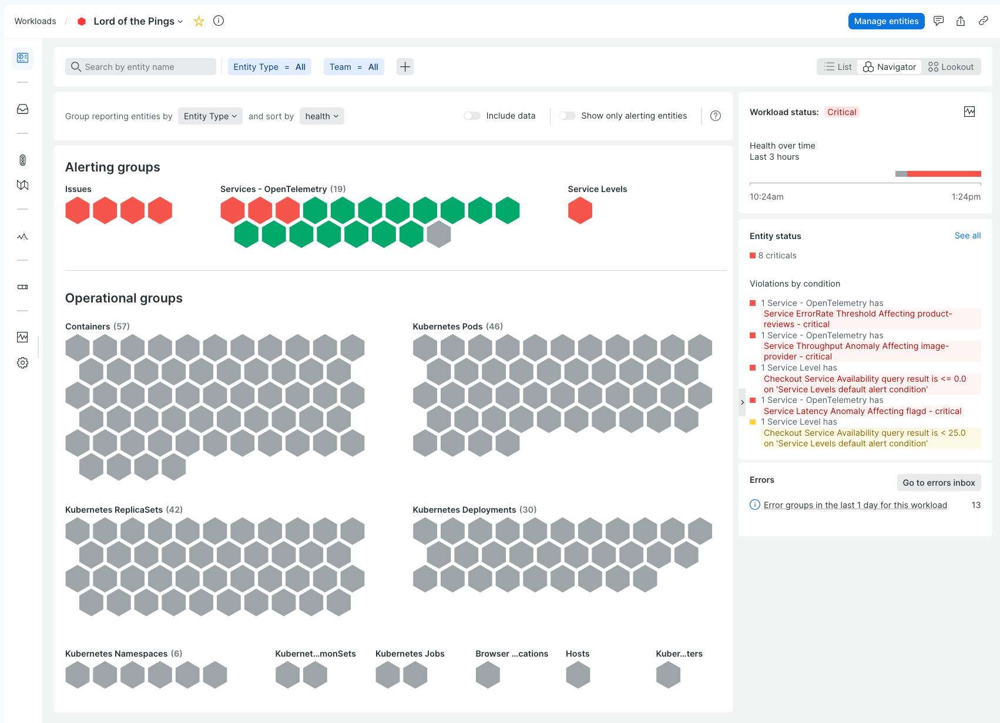

## 🚀 Congratulations!

Well done in setting up your Workload, this will be a memorable Game Day!

Feel free to check the entities in your workload, perhaps group by `Entity Type`, and in general explore the setup to get familiar with it.

To give you an idea of what to expect, see this example workload after some incidents were triggered!

## ⛔ Wait Before Continuing

**Wait** for your Game Manager's instructions before hitting _"Next"_ below.

Remember: **you want to have all info you can before triggering an incident**, otherwise you may be miss key details.

You're about to get "paged", so good luck! 🎯