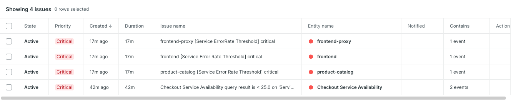
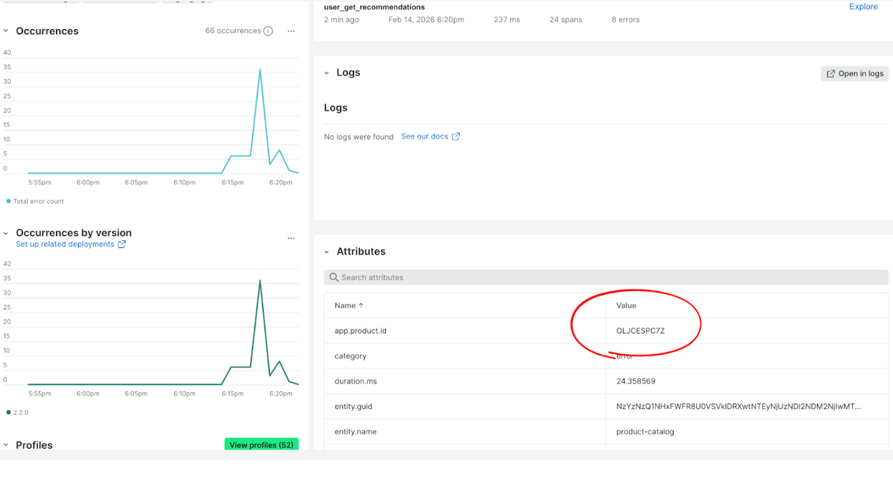

# 🏆 Golden Path: Product Catalog Failure

## What Was Happening

The `productCatalogFailure` feature flag was enabled, causing the **Product Catalog service** to return errors for a specific product (`OLJCESPC7Z` — "Explorascope"). Any customer who tried to view or purchase that product received a 500 error from the product catalog service.

## Alerts For This Incident




## Errors Inbox View

---

## The Ideal Debugging Path

### 1. Start with Your Workload (30 seconds)

Open your New Relic **Workload** and scan the health overview.
You'd see `productcatalogservice` in a degraded/red state with an elevated error rate.

**Why this is the right first move:** Workloads give you a single-pane-of-glass view. Instead of checking each service individually, you immediately see which one is sick.

---

### 2. Check APM Error Rate (1 minute)

Navigate to **APM & Services → productcatalogservice → Summary**.

You'd see:
- Error rate spiking from ~0% to several percent
- Throughput and response time look normal (it's not a latency issue — requests are just failing outright)

**Key insight:** A spike in error rate without a corresponding latency spike means requests are failing fast (not timing out). This narrows the cause significantly.

---

### 3. Open Errors Inbox (2 minutes)

Go to **Errors Inbox** and filter by `productcatalogservice`.

You'd find a new error group with a message like:
```
Error: Product with ID OLJCESPC7Z not found or unavailable
```

Click into the error group and look at the **Occurrences** tab. Notice:
- The same product ID appears in every single trace
- This is not random — it's a specific product

**Why Errors Inbox wins here:** It automatically groups similar errors and shows you frequency, so you immediately know "this error is happening a lot, not just once."

---

### 4. Confirm with Distributed Tracing (2 minutes)

Click on one of the error traces. In the **Trace Waterfall** you'd see:

```
frontend  →  productcatalogservice [ERROR]
                └── GetProduct (OLJCESPC7Z) — status: error
```

Inspect the failing span's attributes:
- `app.product.id`: `OLJCESPC7Z`
- `otel.status_description`: error message from the service
- `error.message`: "Error: Feature flag productCatalogFailure is enabled"

**This is the smoking gun.** The span attribute tells you exactly what triggered the failure.

---

### 5. Correlate with Alerts (optional, 1 minute)

If alerts are configured, you'd see an **Error Rate alert** fired on `productcatalogservice`.
The alert links directly back to the APM summary, confirming your finding.

---

## Summary: The 5-Minute Debug

| Step | Tool | Finding |
|------|------|---------|
| Workload health | Workloads | `productcatalogservice` degraded |
| Error rate spike | APM Summary | Error rate ~10%, latency normal |
| Error message | Errors Inbox | Same product ID in every error |
| Root cause | Distributed Tracing | Feature flag attribute on failing span |

**Total time to root cause: ~5 minutes**

---

## Key Takeaways

- **Error rate ≠ latency issue.** Always check both metrics — they tell different stories.
- **Errors Inbox groups noise into signal.** Instead of reading raw logs, you get a ranked list of what's actually broken.
- **Span attributes are your evidence.** OpenTelemetry-instrumented services emit rich attributes — `app.product.id`, feature flag names — that pinpoint the exact cause.
- **Distributed traces connect the dots.** Even if the alert fires on `frontend`, following the trace shows you the real culprit is `productcatalogservice`.

<!--
BETA NOTES — Incident 1 Golden Path

Improvements:
- Verify screenshot assets exist and render: product-catalog-failure-alerts.png, product-catalog-failure-errors-inbox.png
- Add workload fallback note for teams who skipped the readiness challenge
- "~5 min to root cause" is optimistic for NR newcomers; track actual beta times and update
- Confirm Instruqt gates golden paths behind passing the failure check (feature flag name is a spoiler)

Gameday gotchas:
- Errors Inbox filter scope: if not scoped to service, students drown in unrelated errors — watch for "I don't see the error in Errors Inbox"
- Validate that `error.message: "Feature flag productCatalogFailure is enabled"` actually appears in lab spans
- Error rate spike may be modest (not 100%); teams used to dramatic numbers may not act on it
-->
