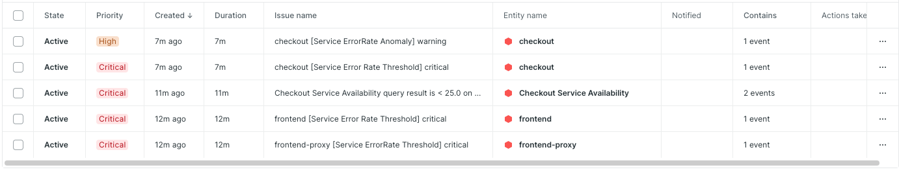
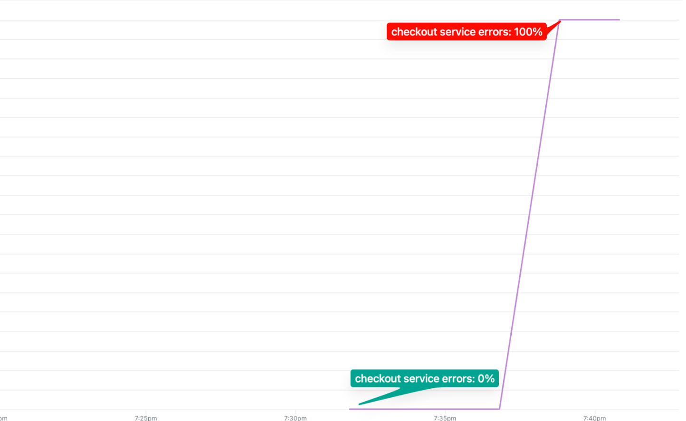

# 🏆 Golden Path: Payment Service Unreachable

## What Was Happening

The `paymentUnreachable` feature flag was enabled, causing the **Checkout service** to use a bad address when calling the **Payment service**. Every checkout attempt resulted in a connection failure — the checkout service could not reach the payment service at all. 100% of orders were failing.

## Alerts For This Incident




## Error Chart For This Incident



---

## The Ideal Debugging Path

### 1. Reproduce and Observe (1 minute)

Open the Astronomy Shop and try to place an order. You'd immediately see an error on the checkout page — something like "Order failed" or "Payment processing error."

**Why reproduce first:** Customer-reported symptoms are your best starting point. Reproducing the issue confirms it's real and gives you a concrete user journey to trace.

---

### 2. Check Workload & Alerts (30 seconds)

Go to your New Relic **Workload** and scan for degraded entities.
You'd see `checkoutservice` flagged with a high error rate.

An alert may have already fired — click through from the alert to land directly in APM on the affected service.

**Why start with the workload:** Alerts and workloads aggregate signal from multiple services so you skip the "which of 15 services is broken?" guessing game.

---

### 3. APM: Identify the Error Spike (1 minute)

In **APM → checkoutservice → Summary**, you'd see:
- **Error rate** spiked sharply to near 100% on the `PlaceOrder` transaction
- **Throughput** is unchanged — requests are coming in, they're just all failing

This confirms the issue is errors, not latency or traffic.

---

### 4. Distributed Tracing: Follow the Failure (2 minutes)

In **APM → checkoutservice → Distributed Tracing**, filter for traces with errors.

Open a failing trace. The waterfall looks like:

```
frontend  →  checkoutservice [ERROR]
                └── PlaceOrder
                      └── chargeService (gRPC call to paymentservice) [ERROR]
                            error: "connection refused: dial tcp: no such host"
```

**Key observation:** The error originates in `checkoutservice` on the span where it calls `paymentservice`. The `paymentservice` itself has **no spans** in the trace — because the connection never reached it.

**This is the critical insight:** When the *client* can't connect to the *server*, the error appears on the *client's span*, not the server's. The server shows no traffic at all.

---

### 5. Confirm: Check paymentservice Traffic (1 minute)

Go to **APM → paymentservice → Summary**.

You'd see: **zero throughput** during the incident window. No requests reaching it at all — confirming this is a connectivity issue, not a payment service crash.

**Why this matters:** If `paymentservice` had its own errors, you'd see traffic with failures. Zero traffic means it's unreachable from the outside — a network/routing issue.

---

### 6. Root Cause: The Error Message (30 seconds)

Back in the failing trace, inspect the span attributes on the failing gRPC call:
- `rpc.system`: `grpc`
- `rpc.service`: `oteldemo.PaymentService`
- `error.message`: `"connection refused"` or `"no such host: paymentservice-invalid"`

The error message tells you exactly: the checkout service is trying to connect to an address that doesn't exist or isn't accepting connections.

---

## Summary: The 5-Minute Debug

| Step | Tool | Finding |
|------|------|---------|
| Reproduce | Astronomy Shop | Checkout fails 100% of the time |
| Alert triage | Workload / Alerts | `checkoutservice` error rate spike |
| Error type | APM Summary | PlaceOrder failing, not slow |
| Root cause | Distributed Tracing | Connection refused on payment gRPC call |
| Confirm | paymentservice APM | Zero incoming traffic = unreachable |

**Total time to root cause: ~5 minutes**

---

## Key Takeaways

- **The error lives on the caller, not the callee.** When a service can't reach another, the span with the error belongs to the service that made the call. Don't get confused looking at the payment service for errors when it's the checkout service's span that failed.
- **Zero throughput is a clue.** If downstream service metrics show no traffic during an outage, it's a connectivity problem — the requests never arrived.
- **Error messages in spans are your evidence.** "Connection refused" or "no such host" in span attributes immediately tells you it's a network/DNS issue, not a logic bug.
- **Distributed tracing maps service dependencies.** Without it, you'd have to guess which service is calling which. With it, the callgraph is right there in the waterfall.
