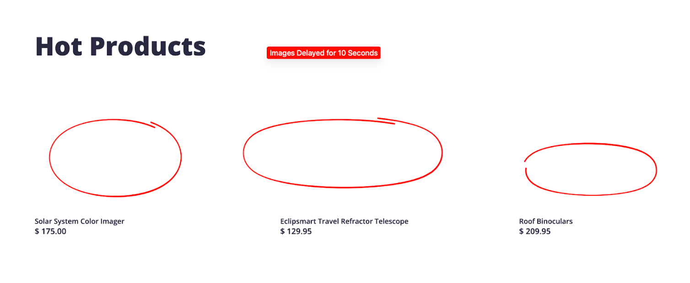

# 🏆 Golden Path: Image Slow Load

## What Was Happening

The `imageSlowLoad` feature flag was enabled, injecting artificial latency into the **Image Provider service** for every image request. Product pages appeared to load (HTML and text came through fine) but images took seconds to appear. This caused **Largest Contentful Paint (LCP)** — a Core Web Vital — to spike dramatically, signaling a poor user experience even without errors.

## Homepage View



---

## The Ideal Debugging Path

### 1. Start with the Symptom: Reproduce (1 minute)

Open the Astronomy Shop and click into any product detail page. You'd immediately notice:
- The page skeleton and text load quickly
- The product image takes **many seconds** to appear

**Why this matters:** The symptom is visual. This tells you the issue is likely in content delivery (images, static assets) — not in the main application logic.

---

### 2. Check Browser Monitoring: Core Web Vitals (2 minutes)

In New Relic, go to **Browser → [Astronomy Shop app] → Core Web Vitals**.

You'd see:
- **LCP (Largest Contentful Paint)** is severely elevated — far above the "Good" threshold of 2.5 seconds
- **FID and CLS** are likely normal — this confirms the issue is specifically about loading large content (images), not interactivity

Go to the **AJAX** tab in Browser and look at requests by URL:
- You'd see requests to `/images/...` or the image provider path with very high average durations (multiple seconds per request)

**Why Browser is the right starting point here:** This is a user-experience problem. Error rates are fine. APM alone might not reveal it without first knowing *which service* to look at. Browser connects the user-perceived slowness to the backend service causing it.

---

### 3. Follow the AJAX Call into APM (2 minutes)

From the slow AJAX entry in Browser, you can often click through to the associated backend transaction.

Alternatively, go to **APM & Services** and look for services with elevated **response time**:
- `imageprovider` will show a dramatically elevated average response time
- The error rate is 0% — this is purely a latency problem

Click into `imageprovider → Transactions` and find the image-serving transaction. The response time is orders of magnitude higher than baseline.

---

### 4. Distributed Tracing: Confirm the Span (1 minute)

In **APM → imageprovider → Distributed Tracing**, open a slow trace.

The waterfall shows:
```
frontend  →  imageprovider [SLOW]
                └── GET /images/{product-id}.jpg
                      duration: 500ms–30,000ms  ← artificial delay
```

Inspect the span attributes:
- `http.url`: points to an image resource
- `duration`: consistently very high for every request
- No error status — just slow

**The key insight:** Every image request is uniformly slow. This is the signature of **artificial/injected latency** — not a real infrastructure problem like a slow disk or network congestion (which would be intermittent or variable).

---

### 5. Confirm via Alerts (optional)

If a **Browser LCP alert** or an **imageprovider response time alert** was configured, it would have fired at the start of this incident, pointing you directly to the problem area.

This highlights the value of **proactive alerting on Core Web Vitals** — you catch user-experience degradation before customers complain at scale.

---

## Summary: The 5-Minute Debug

| Step | Tool | Finding |
|------|------|---------|
| Reproduce | Astronomy Shop | Images take 5–30 seconds to load |
| User impact | Browser Core Web Vitals | LCP severely elevated |
| Slow AJAX | Browser AJAX tab | Image requests taking seconds |
| Root service | APM → imageprovider | Response time spiked, zero errors |
| Confirm | Distributed Tracing | Every image span has uniform high duration |

**Total time to root cause: ~5 minutes**

---

## Key Takeaways

- **Latency ≠ errors.** This incident had a 0% error rate — traditional error-based alerting would miss it entirely. Response time and Core Web Vitals are essential.
- **Start with the user journey.** Browser monitoring connects what users experience (slow pages) to which backend service is responsible (imageprovider). Without it, you'd have to guess which service to check.
- **LCP is a leading indicator.** Monitoring Core Web Vitals gives you signal on user experience degradation before it becomes a flood of support tickets.
- **Uniform latency is a smell.** When every span for a service has nearly identical high duration, it's likely injected or configured latency — not a random infrastructure issue. Real resource exhaustion causes variable latency.
