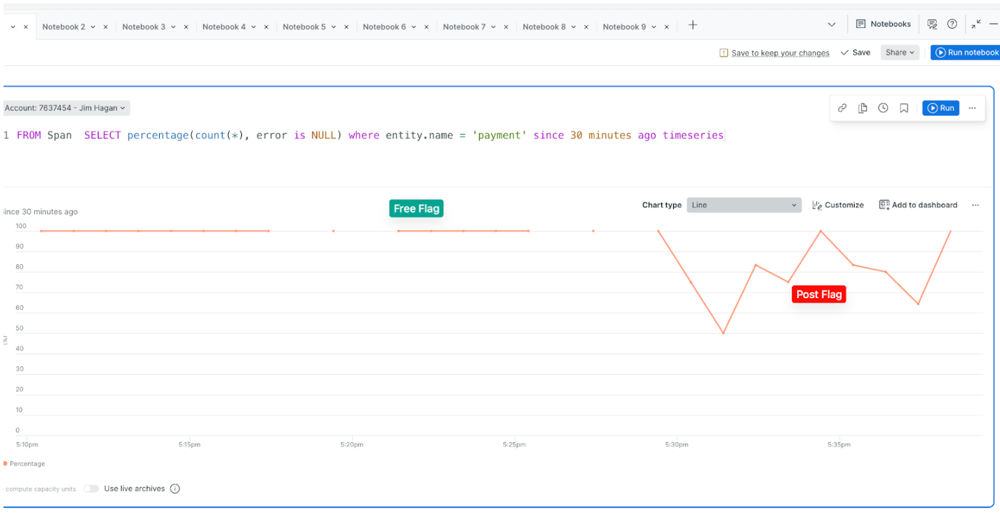

# 🏆 Golden Path: Payment Service Failure

## What Was Happening

The `paymentFailure` feature flag was enabled, causing the **Payment service** to randomly fail a percentage of charge requests. Unlike a total outage, this was an **intermittent failure** — some transactions succeeded while others failed, making it harder to diagnose because the system appeared to be "working" some of the time.

## Error Rate Chart



---

## The Ideal Debugging Path

### 1. Reproduce the Intermittent Behavior (2 minutes)

Open the Astronomy Shop and attempt **multiple** checkouts. On some attempts you'd get:
```
"An error occurred while processing your payment"
```
On others, the order goes through normally.

**Why multiple attempts matter:** Intermittent failures require you to observe a pattern, not just a single failure. If you assume it's a one-time blip after one failure, you'll miss it. If you test repeatedly, you confirm it's reproducible and frequent.

---

### 2. Check APM: Spot the Elevated Error Rate (1 minute)

Go to **APM & Services** and look at the error rate column.

You'd see:
- `paymentservice` showing an error rate of ~20–30% (not 0%, not 100%)
- `checkoutservice` may also show elevated errors — but the real error is generated *inside* `paymentservice`, not checkout

**Key insight:** When error rate is non-zero but not 100%, you're dealing with an intermittent fault. The service is still processing most requests — only a fraction fail.

---

### 3. Errors Inbox: Identify the Pattern (2 minutes)

Go to **Errors Inbox** and filter by `paymentservice`.

You'd find an error group with a message like:
```
Payment processing failed: ChargeRequest declined
```
or
```
Error: PaymentFailure flag is enabled — charge rejected
```

Look at the **occurrence graph** in Errors Inbox. You'd notice:
- Errors are occurring consistently over time (not a single burst)
- The error rate matches the flag's configured failure percentage

**Why Errors Inbox is ideal here:** It groups all the intermittent failures into one error group, showing you frequency and trend — instead of hunting through hundreds of individual trace records.

---

### 4. Distributed Tracing: Compare Success vs Failure (2 minutes)

In **APM → paymentservice → Distributed Tracing**, filter for traces with errors.

Open a **failing trace** and a **successful trace** side by side:

**Failing trace:**
```
checkoutservice  →  paymentservice [ERROR]
                        └── ChargeRequest
                              status: Error
                              error.message: "Payment declined"
                              app.payment.amount: $42.00
```

**Successful trace:**
```
checkoutservice  →  paymentservice [OK]
                        └── ChargeRequest
                              status: OK
                              app.payment.amount: $18.50
```

Comparing the two, you'd notice:
- The failing span is within `paymentservice` itself — not a connectivity issue
- The `paymentservice` *receives* the request (unlike Incident 2 where it received no traffic)
- The error is generated inside the payment processing logic

**The key difference from Incident 2:** In that incident, `paymentservice` showed zero traffic. Here it shows traffic with intermittent errors — the service is reachable, but something inside it is failing.

---

### 5. Span Attributes: Look for Correlations (1 minute)

Examine the `app.payment.amount` attribute across multiple failing vs successful traces.

In the real `paymentFailure` flag scenario, the failure is **random** — not correlated to amount. This distinguishes it from a business-logic bug (which would correlate with specific amounts or products).

If you suspected a business logic issue, you could use **NRQL** to query:

```sql
SELECT count(*), average(app.payment.amount)
FROM Span
WHERE service.name = 'paymentservice'
  AND otel.status_code = 'ERROR'
FACET error.message
SINCE 30 minutes ago
```

---

## Summary: The 5-Minute Debug

| Step | Tool | Finding |
|------|------|---------|
| Reproduce | Astronomy Shop | Checkout fails ~25% of attempts |
| Service triage | APM Summary | `paymentservice` ~25% error rate |
| Error grouping | Errors Inbox | Single error type, consistent frequency |
| Root cause | Distributed Tracing | Error generated inside paymentservice.ChargeRequest |
| Pattern analysis | Span attributes | Failures are random, not correlated to amount |

**Total time to root cause: ~5 minutes**

---

## Key Takeaways

- **Intermittent ≠ coincidence.** A consistent ~25% error rate means a systematic issue, not random bad luck. Reproduce it multiple times to confirm.
- **Error location matters.** Error in `paymentservice` spans = the service is reachable and processing requests, but failing internally. This is different from connection errors in the caller's spans (Incident 2).
- **Errors Inbox turns noise into signal.** Instead of reading 1,000 individual traces, Errors Inbox groups them and shows you trend, frequency, and the exact error message immediately.
- **Trace comparison unlocks insights.** Putting a failing trace next to a successful trace visually highlights exactly what differs — the most efficient way to find correlations.
- **NRQL for deeper analysis.** When simple trace inspection isn't enough, querying span attributes with NRQL lets you statistically test hypotheses (e.g., "does failure correlate with amount?") at scale.

<!--
BETA NOTES — Incident 4 Golden Path

Improvements:
- Verify asset renders: random-payment-failure-chart.png
- "~20–30%" error rate here should align to whatever value the failure path check script accepts — pick one number and use it consistently
- NRQL Step 5 is the most advanced moment in the track; frame it as optional/bonus for less technical teams
- Consider prompting teams to actually run the NRQL query rather than just reading it

Gameday gotchas:
- Validate NRQL attribute name (`otel.status_code` vs `span.status_code`) and value case in the live environment — a broken query is a credibility hit
- Verify `app.payment.amount` is actually emitted in OTel spans; if missing, Step 5's correlation analysis collapses
- Students who answered "20%" on the failure path may be confused by "~20–30%" here — alignment matters
-->
